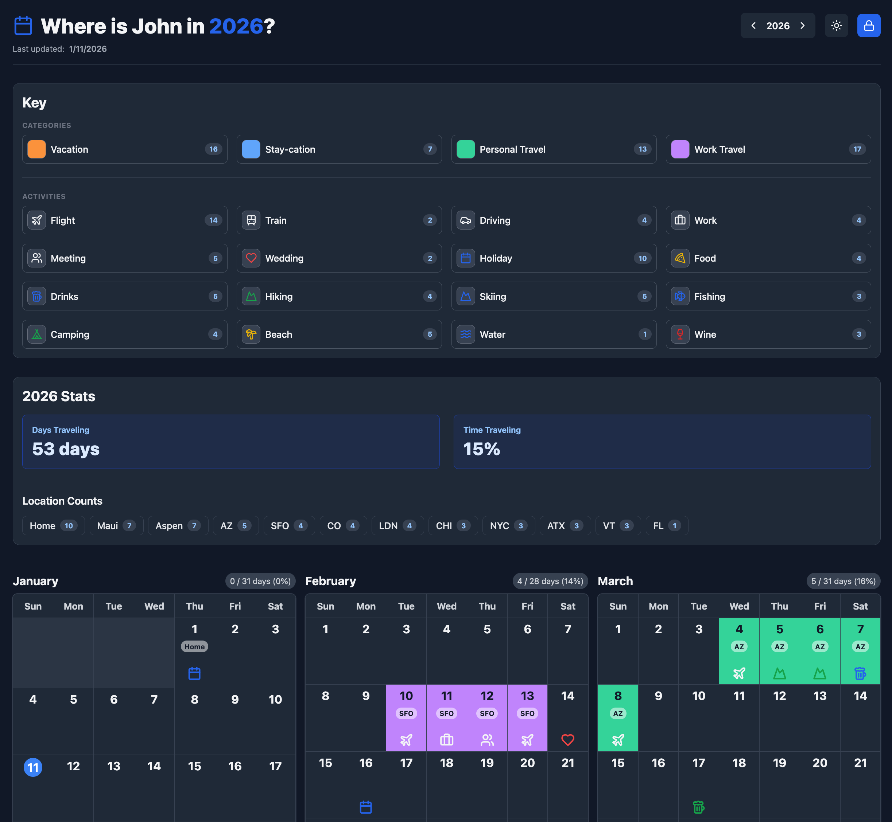
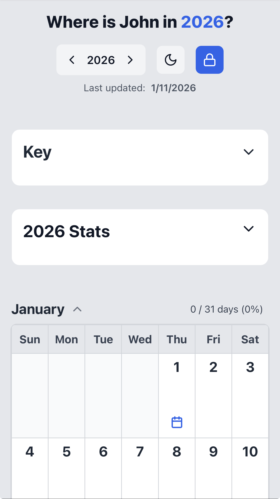
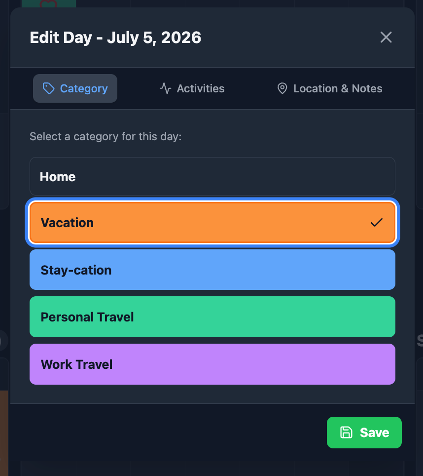
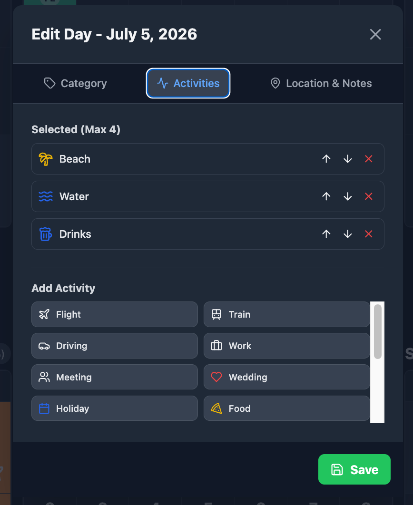
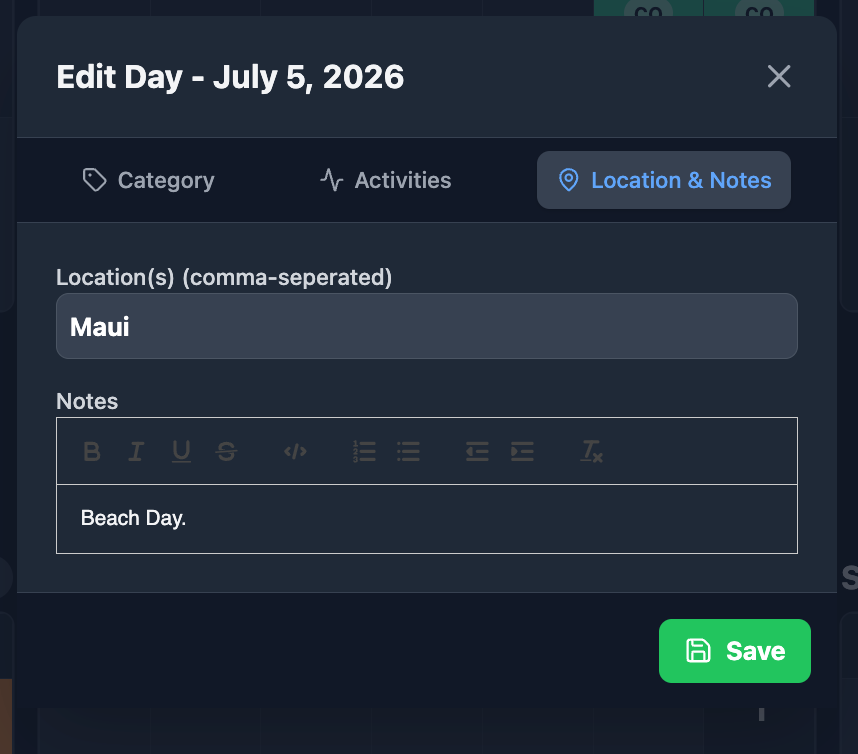
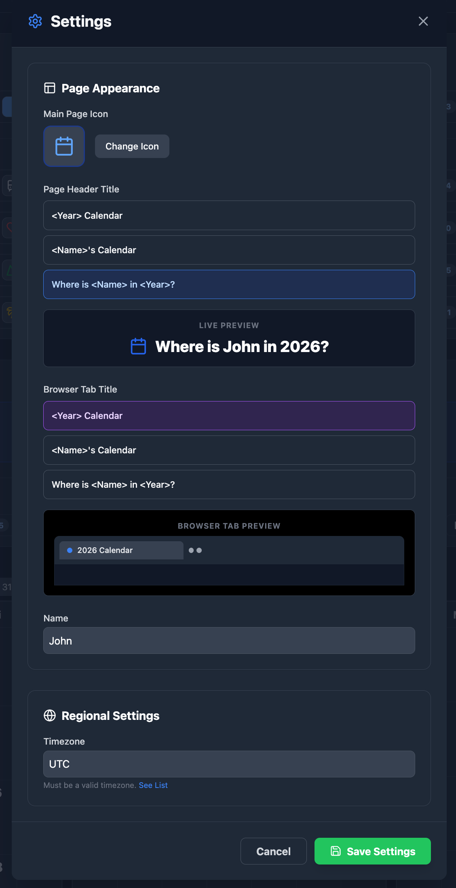
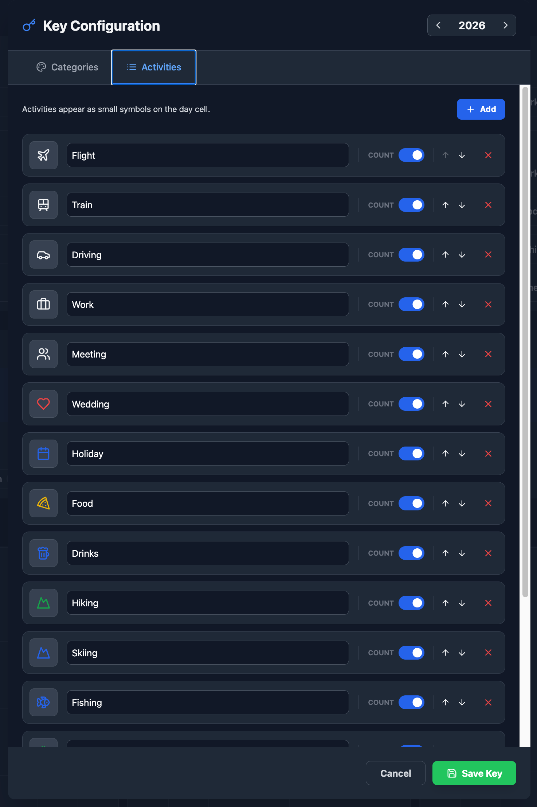

# A Simple Self-Hosted Calendar App

### A self-hosted, real-time calendar and activity tracker built with React, Node.js, and Docker.

This self-hosted calendar provides a simple web dashboard to share your schedule with friends and family. It tracks your upcoming travel plans to keep your personal network informed and displays your availability so others can plan accordingly.

## Try it yourself: [Live Demo](https://calendar-demo.conway.im/)  
**GitHub:** [thebronway/calendar-app](https://github.com/thebronway/calendar-app)  
**Docker Hub:** [thebronway/calendar-app](https://hub.docker.com/r/thebronway/calendar-app)  
**Documentation:** Read the [User Guide](./docs/USER_GUIDE.md) for setup, configuration, and feature details.  
**Roadmap:** See planned features in the [Project Roadmap](./ROADMAP.md).  
**Changelog:** Review past releases in the [Changelog](./CHANGELOG.md).

## Features

* **Visual Dashboards:** Responsive Year, Month, Planner, and List views with dark mode.
* **Customization:** Color-coded categories, icons, and daily display names.
* **Smart Tracking:** Real-time stats, location tagging, and rich-text notes.
* **Quick Editing:** Multi-day bulk editing and instant WebSocket sync.
* **Interactive Sharing:** Clickable highlight filters and dynamic URL sharing.
* **Calendar Sync:** Custom iCal subscriptions to export filtered events to your Apple/Google calendar.
* **Access Control:** Password-protected Admin mode with a public read-only view.

**Note:** For production use, it is strongly recommended to protect your instance using a reverse proxy and authentication service (e.g., Nginx and Authentik).

## Screenshots

Click to expand screenshots

#### Default View Mode (Desktop)

#### Default View Mode (Mobile)

#### Admin Edit Day

#### Admin Settings

## Quick Start

This application is designed to be deployed using **Docker**. 

Please refer to the [User Guide](./docs/USER_GUIDE.md#2-installation--deployment) for the `docker-compose.yml` configuration and full deployment instructions.

## Author
Check out my other projects at [brian.conway.im](https://brian.conway.im/).

## Acknowledgments
This project was coded with AI assistance, but fully reviewed, tested, and approved by hand. See [AIACKNOWLEDGMENT.md](AIACKNOWLEDGMENT.md) for details.

*This software is provided "as is", without warranty of any kind, express or implied.*
