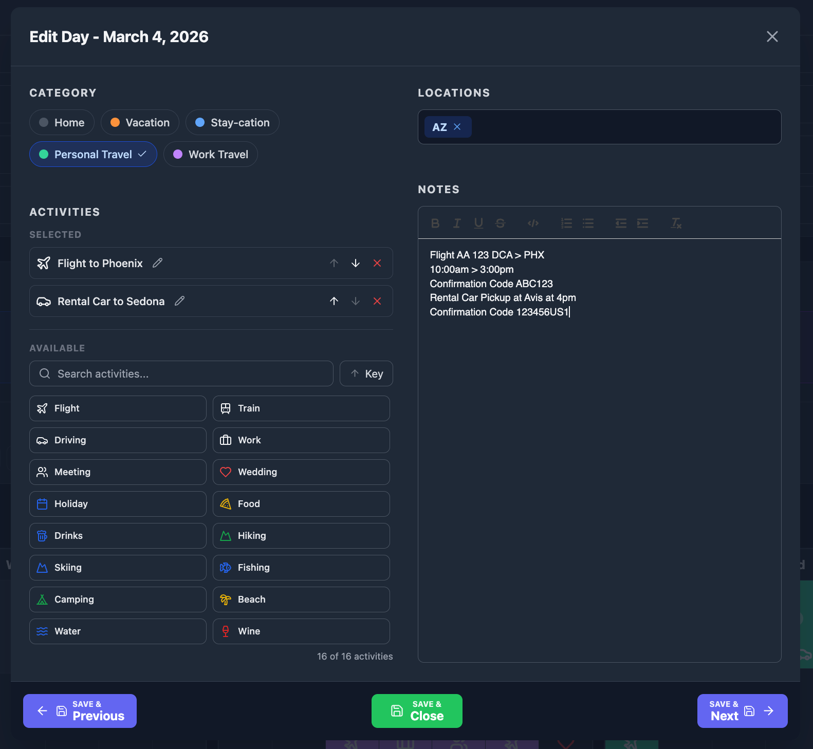
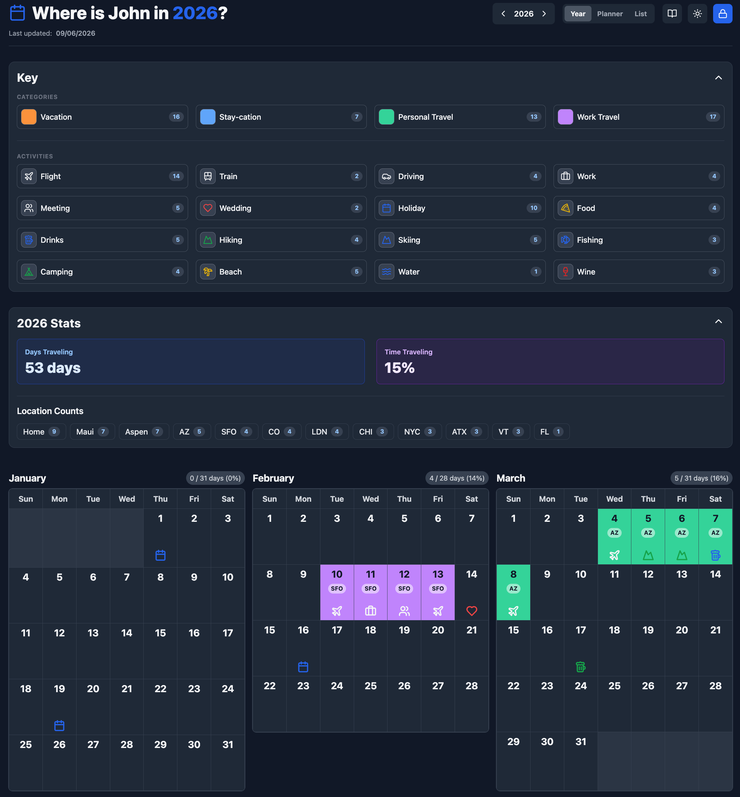
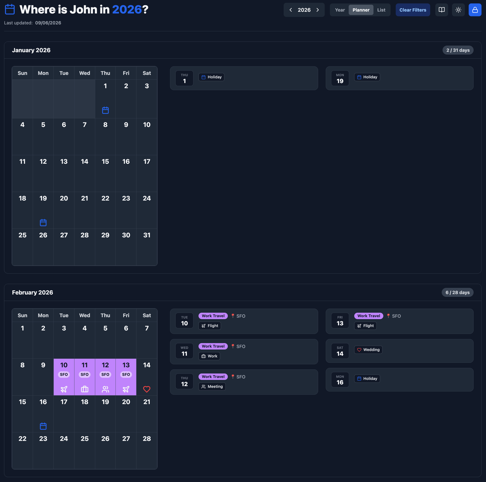
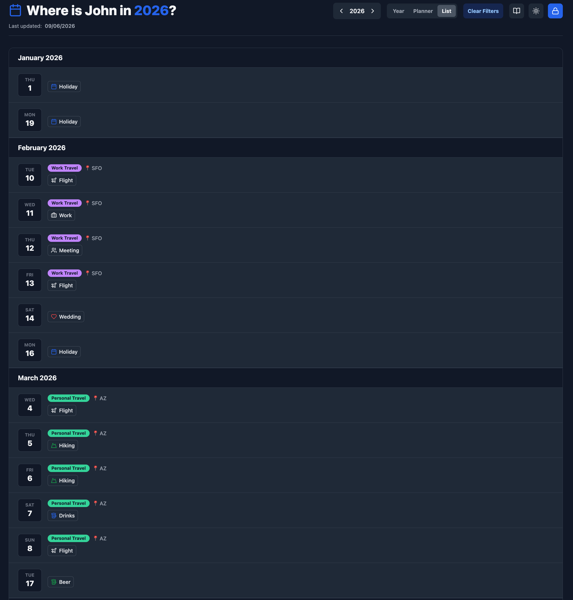
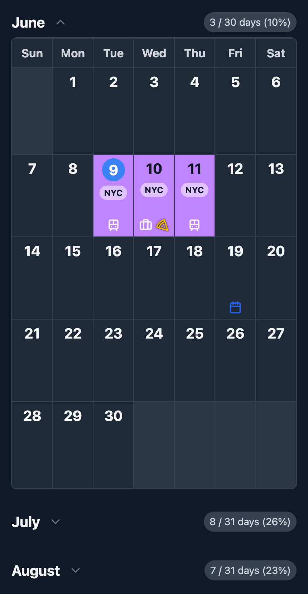
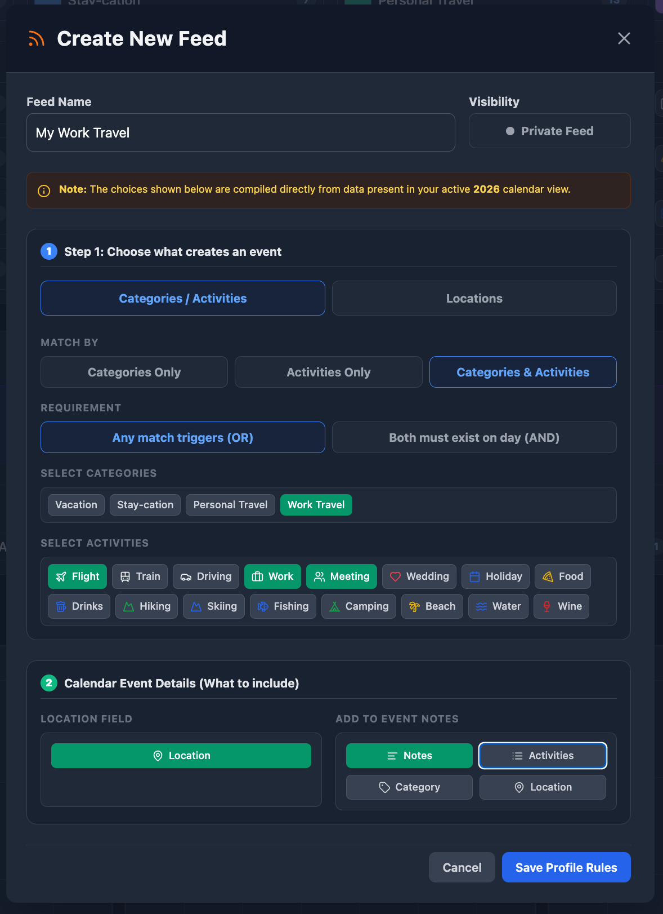

# Calendar-App User Guide

*Last updated: 2026-06-09*  

Calendar-App is a self-hosted, year-at-a-glance dashboard designed to help you track travel, availability, and daily activities, and share them easily with friends and family.

This guide covers everything you need to know to deploy, configure, and use your calendar.

---

## Table of Contents
1. [Introduction & Overview](#1-introduction--overview)
2. [Installation & Deployment](#2-installation--deployment)
3. [Authentication & Access](#3-authentication--access)
4. [Global Settings & Appearance](#4-global-settings--appearance)
5. [Configuring the "Key" (Categories & Activities)](#5-configuring-the-key-categories--activities)
6. [Adding and Editing Events](#6-adding-and-editing-events)
7. [Navigating the Calendar Views](#7-navigating-the-calendar-views)
8. [Stats, Filters, and Sharing](#8-stats-filters-and-sharing)
9. [Keyboard Shortcuts & Tips](#9-keyboard-shortcuts--tips)
10. [iCal Subscriptions (Syncing)](#10-ical-subscriptions-syncing)

---

## 1. Introduction & Overview

The Calendar App provides a real-time, visual overview of your year. It relies on two main concepts to keep things organized:
* **Categories:** These dictate the background color of a day on the calendar (e.g., "Vacation" = Orange, "Work Travel" = Purple). A day can only have **one** Category.
* **Activities:** These are small icons that appear inside the day cell (e.g., a plane icon for "Flight", a pizza icon for "Food"). A day can have up to **four** Activities.

---

## 2. Installation & Deployment

This application is designed to be run using Docker. 

### Prerequisites
* Docker and Docker Compose installed on your host machine.

### Standard Setup
Create a `docker-compose.yml` file with the following configuration:

```yaml
version: '3.8'

services:
  calendar-app:
    image: thebronway/calendar-app:latest
    container_name: calendar
    restart: unless-stopped
    ports:
      - "8080:80"
    volumes:
      - ./calendar_data:/app/data
    environment:
      # REQUIRED: Set this to a secure password
      - ADMIN_PASSWORD=your_secure_password_here
      # OPTIONAL VARIABLES:
      - TIMEZONE=America/New_York
      - PAGE_BANNER_HTML=<b>Welcome!</b>
```

Run `docker-compose up -d` to start the application. It will be accessible at `http://localhost:8080`.

### Environment Variables
| Variable | Description |
| :--- | :--- |
| **`ADMIN_PASSWORD`** | **(Required)** The master password used to log in and edit the calendar. |
| **`DATA_DIR`** | **(Required)** Path where JSON data files are stored. Defaults to `/app/data`. |
| **`TIMEZONE`** | (Optional) Default timezone for the calendar (e.g., `UTC`, `America/Chicago`). |
| **`PAGE_BANNER_HTML`** | (Optional) Custom HTML banner displayed at the very top of the page. |

---

## 3. Authentication & Access

The calendar operates on a dual-tier access system:
* **Public View-Only Mode:** Anyone who visits your URL can see the calendar, click on days to read notes, and use the filters. They cannot make any changes.
* **Admin Mode:** Clicking the **Lock icon** in the header allows you to enter your `ADMIN_PASSWORD`. Once authenticated, you will see new buttons for Bulk Edit, Key configuration, and Settings, and you can edit individual days.

*Note: Your session will automatically expire after 24 hours, or you can click the Logout button to end it immediately.*

### Reverse Proxy Routing
If running the application behind an authentication proxy (such as Authentik), ensure your server configuration route matches the standard login endpoint under this section:
`location = /api/auth/login`

---

## 4. Global Settings & Appearance

Once logged in, click the **Settings (gear) icon** to customize how your calendar looks.

### Page Appearance
* **Main Page Icon:** Change the large icon displayed next to your header title.
* **Header Title & Browser Tab Style:** Choose between Simple (`2026 Calendar`), Possessive (`John's Calendar`), or Question formats (`Where is John in 2026?`).
* **Owner Name:** If using a Possessive or Question format, enter your name here.
* **Hide Key & Stats on Desktop:** Toggle this to hide the Key and Stats panels on large screens by default (mobile views will keep them in collapsible accordions).

### Regional Settings
* **Timezone:** Ensure your calendar highlights "Today" correctly based on your location. 

---

## 5. Configuring the "Key" (Categories & Activities)

Click the **Key icon** to define the visual language of your calendar.

* **Importing:** If you used the calendar last year, you can click "Import from [Previous Year]" at the bottom to instantly copy over your colors and icons.

### Categories (Background Colors)
* You can define up to **5** categories.
* Assign a name and a color.
* Toggle the "Count" switch to display how many days are assigned to this category in the main Key panel.
* Use the up/down arrows to reorder how they appear in the UI.

### Activities (Icons)
* Search through hundreds of available icons.
* Assign an icon color and label.
* Toggle the "Count" switch to track how many times you do this activity throughout the year.

---

## 6. Adding and Editing Events

<details>
<summary>View Day Editor Interface (Desktop)</summary>

</details>

### Single Day Editing
Click any day on the calendar to open the Cell Editor.
1. **Category:** Select one category (or "Home" to clear it).
2. **Activities:** Search and add up to 4 activities. 
    * *Tip: Click the pencil icon next to an added activity to give it a custom display name just for that day (e.g., renaming "Flight" to "JFK -> LHR").*
3. **Location & Notes:** * Add comma-separated locations (e.g., "NYC, London"). These will be tracked in your stats.
    * Add rich-text notes (bold, lists, links) to record flight numbers, hotel details, or journaling.

### Bulk Edit Mode
To quickly log long trips:
1. Click **Bulk Edit** in the header.
2. Click multiple days on the calendar (they will highlight with a purple ring).
3. A floating bar will appear at the bottom. Click **Edit**.
4. Any Category, Activity, or Location you apply will be saved to *all* selected days at once.

---

## 7. Navigating the Calendar Views

<details>
<summary>View Year Layout (Desktop)</summary>

</details>

<details>
<summary>View Planner Layout (Desktop)</summary>

</details>

<details>
<summary>View List Layout (Desktop)</summary>

</details>

<details>
<summary>View Mobile Layout</summary>

</details>

Use the navigation toggle in the header (to switch between Year, Planner, and List views) or click a specific month name to change your view:

* **Year View (Default):** A dense, 12-month grid perfect for seeing your entire schedule at a glance.
* **Planner View:** A split-screen dashboard showing a single month's grid on the left, and a continuous chronological feed of events for that month on the right.
* **List View:** A continuous, scrolling timeline aggregating all your active events chronologically by month.
* **Single Month View:** Clicking a month name (e.g., "July") isolates that month and displays a dynamic mini-key showing only the categories and activities present in that specific month.

---

## 8. Stats, Filters, and Sharing

### The Stats Panel
Located below the Key, this panel calculates:
* **Days Traveling:** Total days assigned to a category.
* **Time Traveling:** The percentage of the year you are away.
* **Location Counts:** A leaderboard of your most frequent destinations.

### Interactive Highlighting (Soft Filtering)
Want to see every time you went skiing or visited New York?
* Click any Category or Activity in the **Key**.
* Click any Location in the **Stats panel**.
* The calendar will instantly dim unrelated days and highlight your selections.
* Click the **Clear Filters** button in the main page header at any time to reset active filters and return to the full calendar view.

### Dynamic URL Filtering (Hard Filtering)
If you want to share a specific itinerary with someone (e.g., just your "Work Travel" and "Flights"):
1. Highlight your desired items in the Key.
2. Click **View as List** or **View as Planner** in the Key header.
3. The URL will update with your filters (e.g., `?a=flight&c=work-travel`).
4. Copy and share that link! Visitors will only see the days that match those specific filters.

---

## 9. Keyboard Shortcuts & Tips

* **Arrow Keys (`←` / `→`):** Instantly navigate to the previous or next year when viewing the main dashboards. If a single day cell is open in the viewer/editor, these keys instead step backward or forward to the adjacent day sequentially (and will explicitly warn you if you attempt to leave with unsaved changes).
* **`Esc` Key:** Close any open modal or cancel out of the day editor without saving.
* **Saving:** If you edit a day and attempt to close the window without saving, the app will warn you to prevent data loss.

---

## 10. iCal Subscriptions (Syncing)

You can sync your travel and activities directly to your personal calendar (Apple Calendar, Google Calendar, Outlook) using custom continuous iCal feeds. 

<details>
<summary>View Feed Creator Interface (Desktop)</summary>

</details>

### Creating a Feed (Admin Only)
1. Click the **Feeds (RSS) icon** in the header to open the Feed Manager.
2. Click **New Feed** and provide a descriptive name.
3. **Step 1: The Event Trigger (What creates the block?):**
    * Choose between **Categories / Activities** or **Geographic Locations** to dictate what scans your calendar database.
    * *Categories / Activities Mode:* Select what data elements to look for. If combining both, you can apply strict conditional logic rules (OR means any matching item creates an event; AND requires both to exist on the same day).
    * *Geographic Locations Mode:* Set the feed to match any day containing location entries, or target explicit matching cities/regions.
    * *Grouping Strategy:* Select **Separate Events** to split items out into independent overlapping calendar entries, or **All-in-One Event** to combine multiple elements into a single combined calendar block.
4. **Step 2: The Event Payload (Sub-categories & Details):**
    * Toggle **Map data to Location field** to pass the day's structural geographic data straight into your external calendar's native location text property.
    * Check which supplementary contextual layers to append into the event notes box (Rich-Text Notes, List of Activities, Category Display Name, or Location List).
5. Click **Save Profile Rules**.

*Note on Filters:* The checklist filter items visible inside the builder form are dynamically populated based on active data configurations parsed from the specific calendar Year you are currently viewing.

### Subscribing to a Feed
Once a feed is created, click **Copy URL**. 
* **Apple Calendar:** Go to `File > New Calendar Subscription...` and paste the URL.
* **Google Calendar:** Go to `Settings > Add calendar > From URL` and paste the URL.

*Note: Feeds are continuous and will automatically stitch together data from the previous, current, and next year so your calendar stays perfectly up to date.*

### Reverse Proxy Bypass
If running the application behind an authentication proxy (such as Authentik), you must add an unauthenticated bypass line for the feed extraction route explicitly above your catch-all route:
`location /api/feed/`